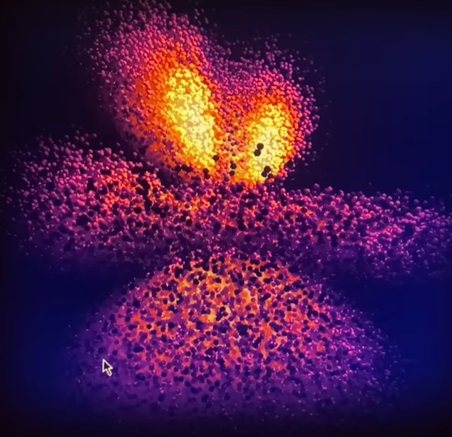

# Model-atoms
Modelling atoms with C++ and some visual software
<br>
The idea is to generate the 3d visual (probability cloud) for a specified element

<p align="center">Image credit: [kavan](https://youtu.be/OSAOh4L41Wg)</p>

# How to Run?
Since this was my first experience using something other than python to create a window and generate things, I had some difficulty. I would assume that you would too, so here's a little preface for anyone who's struggling.
<br>
I use WSL (Windows Subsystem for Linux) so I can run my code in ubuntu. You can download this in the microsoft app store.
<br>
Be sure to install all libraries that are needed for this code to run
<br>
```sh
sudo apt update
sudo apt install build-essential cmake
sudo apt install libglfw3-dev libglew-dev libglm-dev libx11-dev libxcursor-dev libxi-dev libxrandr-dev libxinerama-dev
```
Find the path to the code; in my case it's 
```sh
[XXX]@[XXX]:/mnt/c/Users/[XXX]/Documents/Coding/ModelAtoms$
```
From there run
```sh
g++ main.cpp -o simulation -lglfw -lGLEW -lGL -lm
./simulation
```
After this you may just run "`./simulation`"

# Inspiration
This project was inspired by kavan on youtube.
I highly recommend you to go check out their videos!
Also if I can get this to actually work, all my
projects will be in C++ moving on!

# Afterthought

I haven't finished this so there's little afterthought to put here! I hope that this project will allow me to have a deeper grasp of physics, coding, and chemistry.